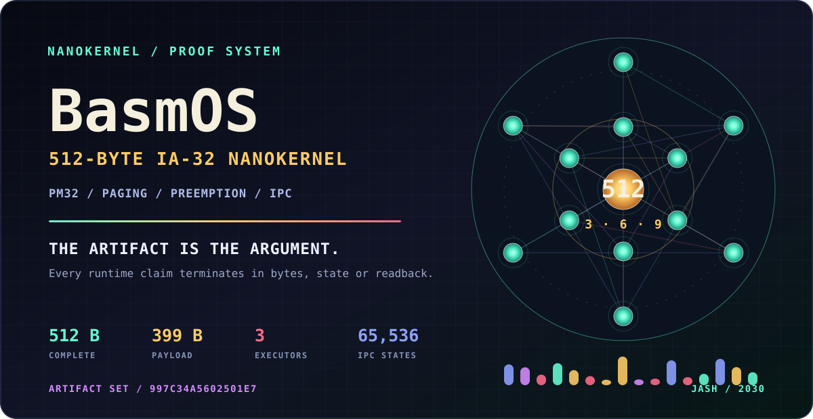
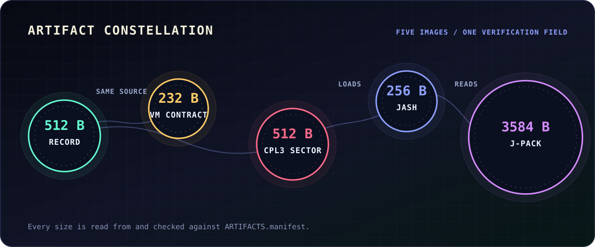
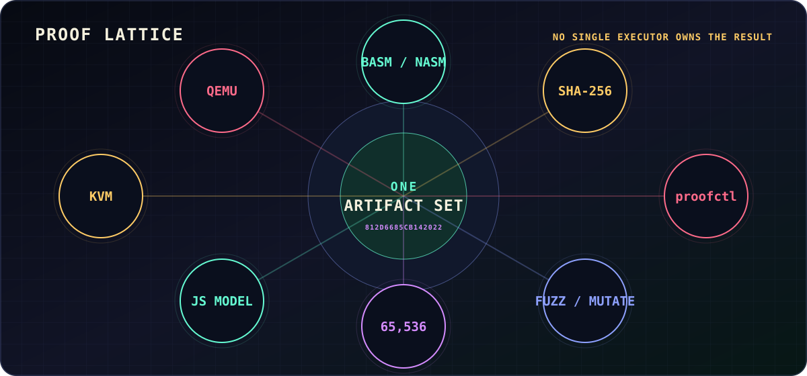
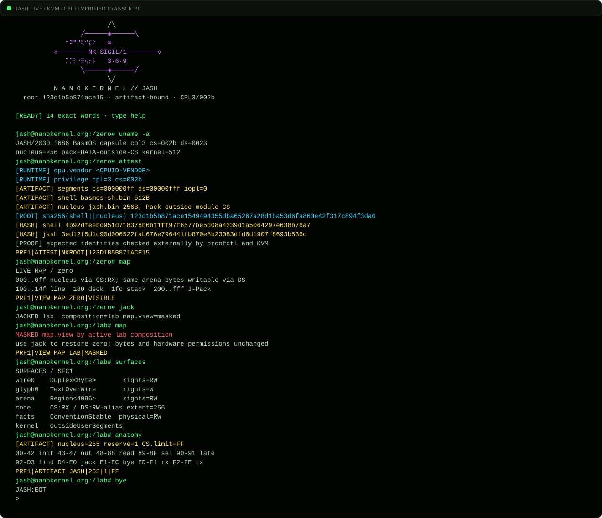

<!-- SPDX-License-Identifier: BSD-3-Clause -->
<!-- Copyright (c) 2026, F E R M I ∞ H A R T <contact@fermihart.com> -->

<p align="center">
  <a href="https://nanokernel.org/#/basmos">
    <picture>
      <source media="(max-width: 600px)" srcset="readme/hero-proof-geometry-mobile.svg">
      
    </picture>
  </a>
</p>

<h1 align="center">BasmOS</h1>

<p align="center">
  <strong>A complete protected-mode nanokernel artifact inside one 512-byte boot sector.</strong><br>
  Paging. Timer preemption. Two bounded tasks. SPSC IPC. No second stage.
</p>

<p align="center">
  <a href="https://nanokernel.org/#/basmos/run"><strong>BOOT THE 512 BYTES</strong></a>
  · <a href="#reproduce">RUN THE PROOF</a>
  · <a href="RESEARCH.md">READ THE RECORD</a>
  · <a href="evidence/jash-session.txt">ENTER JASH / 2030</a>
</p>

---

## The Artifact

`basmos.bin` is not a kernel payload hidden behind a loader. It is the complete
bare-metal path from BIOS entry to demonstrated behavior: IA-32 protected mode,
active PSE paging, a valid IDT, PIC/PIT timer handling, two timer-preempted tasks,
bounded code and data segments, a 256-byte SPSC ring, a live heartbeat and VGA
evidence output.

```text
VGA @ 0xB8000     33 0f   36 0f   39 0a
                    3       6       9
                 task0   task1    IPC ✓
```

- **3** proves the CPU-bound producer reached its own VGA cell.
- **6** requires asynchronous IRQ0 preemption because task0 never sleeps or yields.
- **9** is a byte sent by task0, received by task1 and rendered through the IPC path.

The heartbeat must continue advancing after the first match. A frozen `3 / 6 / 9`
frame is not accepted as a healthy boot.

<p align="center">
  <picture>
    <source media="(max-width: 600px)" srcset="readme/artifact-constellation-mobile.svg">
    
  </picture>
</p>

## Five Committed Images

| Image | Bytes | Contract |
|---|---:|---|
| [`basmos.bin`](basmos.bin) | **512** | Complete bare-metal record artifact |
| [`basmos-vm.bin`](basmos-vm.bin) | **232** | Direct PM32+paging guest for the documented bEMU machine contract |
| [`basmos-sh.bin`](basmos-sh.bin) | **512** | Sibling kernel with TSS-backed CPL3 monitor and module loader |
| [`jash/jash.bin`](jash/jash.bin) | **256** | JASH CPL3 nucleus: 255 native bytes + 1 reserved byte |
| [`jash/jash-pack.bin`](jash/jash-pack.bin) | **3,584** | Presentation, exact vocabulary and EVM1/SFC1/DCK1/SIG1 manifests |

Exact sizes and complete SHA-256 values live in
[`ARTIFACTS.manifest`](ARTIFACTS.manifest) and [`SHA256SUMS`](SHA256SUMS).
Guest binaries are intentionally versioned because their exact bytes are the
subject of the project. Host executables are never versioned.

## Proof Geometry

No single emulator, compiler or visual output gets to declare success. Eight
verification surfaces exercise complementary parts of the committed artifact set.

<p align="center">
  <picture>
    <source media="(max-width: 600px)" srcset="readme/proof-lattice-mobile.svg">
    
  </picture>
</p>

| Surface | What it must prove |
|---|---|
| **BASM / NASM** | Five independently assembled guest images are byte-identical |
| **SHA-256** | The five committed images and evidence match their manifests |
| **proofctl** | Native sizes, boundaries, command targets, manifests and sigil root agree |
| **65,536 IPC states** | No overwrite, no overread, FIFO ordering, capacity 255 and recovery |
| **QEMU** | BIOS boot, live PIT preemption, VGA readback, descriptors and physical bytes |
| **KVM** | Zero-firmware execution, domain faults, full-ring behavior and CPL3 transitions |
| **JS model** | The shipped 512 bytes reach exact bounded telemetry and VGA state |
| **Fuzz / mutate** | Invalid vocabulary and corrupted invariants fail closed for the right reason |

This is layered evidence, not a claim of complete x86 equivalence. The browser
model implements only the instruction, segmentation and timer behavior required
by this artifact. QEMU and KVM carry different assumptions and must independently
reach the specified observables.

## Engineering Under 512 Bytes

### One byte enters protected mode

At reset, `CR0.PE` is architecturally zero. After loading the register,
`inc ax` sets PE in one byte before the far jump establishes 32-bit execution.

### One store maps 4 MiB

A single PSE directory entry identity-maps the first 4 MiB. The image, IDT,
ring, task windows, stacks, page directory and VGA all remain below 1 MiB.

### Eleven bytes switch worlds

`xchg esp,[es:other_sp] · popad · mov ds,bp · iretd` swaps stacks, restores the
incoming task's bounded data selector and returns through its saved code window.
No current-task index and no scheduler branch are required.

### State lives inside the tasks

The SPSC head and tail live in each endpoint's saved `ECX`. `inc cl` supplies
modulo-256 movement for free; comparing the opposite saved cursor distinguishes
full from empty and yields 255 usable queue entries.

### The stack constructs the IDT

Thirty-five valid gates are written backwards with pushes: exceptions `0..31`,
timer/yield, send and receive. Vector 13 is patched to a distinct fail-stop gate
so negative domain tests can prove the exact fault path.

### Hardware windows bound trusted tasks

Each record task owns a 256-byte DS window and a label-computed CS window. These
segments contain accidental accesses and runaway fetches; they are not a hostile
CPL0 security boundary. Hostile modules belong to the separate CPL3 sibling.

## Sacred Source, Executable

[`basm-nano/basm_sacred.c`](basm-nano/basm_sacred.c) is a generated Metatron's
Cube translation unit around the canonical
[`basm_nano.c`](basm-nano/basm_nano.c). Its geometry is deterministic, and the
canonical source SHA-256 is sealed into the artwork.

The sacred edition does not replace readable code or hide an implementation.
It includes the canonical translation unit, compiles with warnings as errors and
must emit all five guest artifacts byte-for-byte identically.

```sh
make verify-sacred
# sacred metal / contract / ring3 / jash / jpack: BYTE-IDENTICAL
```

The README art follows the same law: `tools/generate_readme_art.py` validates all
five manifest entries against the real files, then derives a domain-separated
visual fingerprint from their paths, lengths and byte streams. CI rejects stale
geometry. The constellation sizes and JASH sigil root cannot drift from their
respective artifacts.

## JASH / 2030

JASH is a real 255-byte IA-32 nucleus plus one reserved byte, executing at CPL3
under `basmos-sh.bin`. Its 3,584-byte data Pack lives outside module CS and holds
14 exact commands over 15 cells. It is writable data, not an immutable or
hardware-NX claim.

```text
             ⠒⠽⠛⡛⢇⠚⣎⠕   ∞
          ◇─────── NK-SIGIL/1 ───────◇
             ⡉⡉⡃⡕⣛⢦⡒⡧   3·6·9

root 123d1b5b871ace15 · artifact-bound · CPL3/002b
```

`NK-SIGIL/1` encodes the first 16 bytes of
`SHA256(basmos-sh.bin || jash.bin)` as Unicode braille, dot for bit. The visible
root, binary `SIG1` manifest and external proof must agree. This is artifact
identity, not measured boot.

<details>
<summary><strong>Open the verified KVM transcript</strong></summary>

<br>

<p align="center">
  
</p>

Plain text: [`evidence/jash-session.txt`](evidence/jash-session.txt) ·
manifest: [`evidence/jash-session.manifest`](evidence/jash-session.manifest)

</details>

## Reproduce

```sh
git clone https://github.com/FermiHart/BasmOS.git
cd BasmOS
make all
make proof
```

`make proof` verifies committed hashes, native structural contracts, independent
NASM assembly when NASM is installed, deterministic README and sacred-source
generation, all 65,536 IPC cursor states bound to the exact handler bytes, a KVM
full-ring execution, QEMU, the bounded JavaScript model, CPL3 behavior, parser fuzzing, mutation rejection,
the JASH capture and the exact Pages allowlist.

Focused gates:

```sh
make verify-ipc       # exhaustive model + exact encoding + KVM full ring
make verify-domains   # positive windows + exact data/code #GP probes
make verify-shell     # QEMU/KVM CPL3, TSS, IRQ0 and hostile modules
make verify-jash      # QEMU/KVM, Decks, manifests, bytes and transcript
make verify-sacred    # canonical and geometric C editions: 5/5 identical
make verify-readme    # artifact-bound SVGs are deterministic and current
```

<details>
<summary><strong>Toolchain requirements</strong></summary>

- Basic build: C compiler, GNU Make and Linux UAPI headers for `<linux/kvm.h>`.
- Full proof: Python 3, Node.js, QEMU `qemu-system-i386`, NASM and `/dev/kvm`.
- Optional sovereign compiler diversity: `make verify-bear BEAR=/path/to/bear`.

</details>

## Boundaries

> **BasmOS is an engineering proof and research artifact, not a production OS.**
> The record tasks execute at CPL0 in one identity-mapped address space. Their
> segment windows constrain accidental behavior, not deliberately hostile kernel
> code. `basmos-sh.bin` is the separate artifact for the CPL3/TSS boundary.

The project deliberately does not claim complete x86 modeling, page-level NX for
J-Pack data, per-process page tables, dynamic process creation or recovery beyond
fail-stop exception handling. Read [`THREAT_MODEL.md`](THREAT_MODEL.md),
[`DOMAINS.md`](DOMAINS.md) and [`RING3.md`](RING3.md) before running untrusted
guest images or modules.

## Research Record

The comparison category requires every candidate to include IA-32 protected
mode, active paging, an IDT and hardware timer, at least two timer-preempted tasks
and functional inter-task IPC in the complete bare-metal artifact.

In the documented public survey completed on **2026-08-19**, BasmOS is the
smallest publicly verifiable artifact found in that category: **512 bytes total,
399-byte payload**. Additional features are allowed, and every byte required from
BIOS entry to demonstrated behavior is counted. This is a reproducible dated
survey result, not certification by an external record authority.

Full evidence, neighbors and limitations: [`RESEARCH.md`](RESEARCH.md).

## Field Manual

| Read | Purpose |
|---|---|
| [`WAVES.md`](WAVES.md) | Verification layers and what each one can honestly establish |
| [`OPTIMIZATIONS.md`](OPTIMIZATIONS.md) | Byte-level engineering decisions and sensitivity accounting |
| [`DOMAINS.md`](DOMAINS.md) | Task data/code windows and exact denial probes |
| [`RING3.md`](RING3.md) | TSS-backed monitor, module protocol and JASH arena |
| [`THREAT_MODEL.md`](THREAT_MODEL.md) | Trust boundaries, non-goals and residual risk |
| [`RELEASING.md`](RELEASING.md) | Clean-room proof, Pages and signed-release procedure |
| [`SECURITY.md`](SECURITY.md) | Private vulnerability reporting |

## License And Author

Original source is released under the [`BSD-3-Clause`](LICENSE). External tools
and system headers are dependencies, not vendored source. The code license does
not grant trademark or endorsement rights; see [`TRADEMARKS.md`](TRADEMARKS.md)
and [`THIRD_PARTY_NOTICES.md`](THIRD_PARTY_NOTICES.md).

<p align="center">
  <strong>F E R M I ∞ H A R T</strong><br>
  <a href="mailto:contact@fermihart.com">contact@fermihart.com</a> ·
  <a href="https://nanokernel.org">nanokernel.org</a>
</p>
